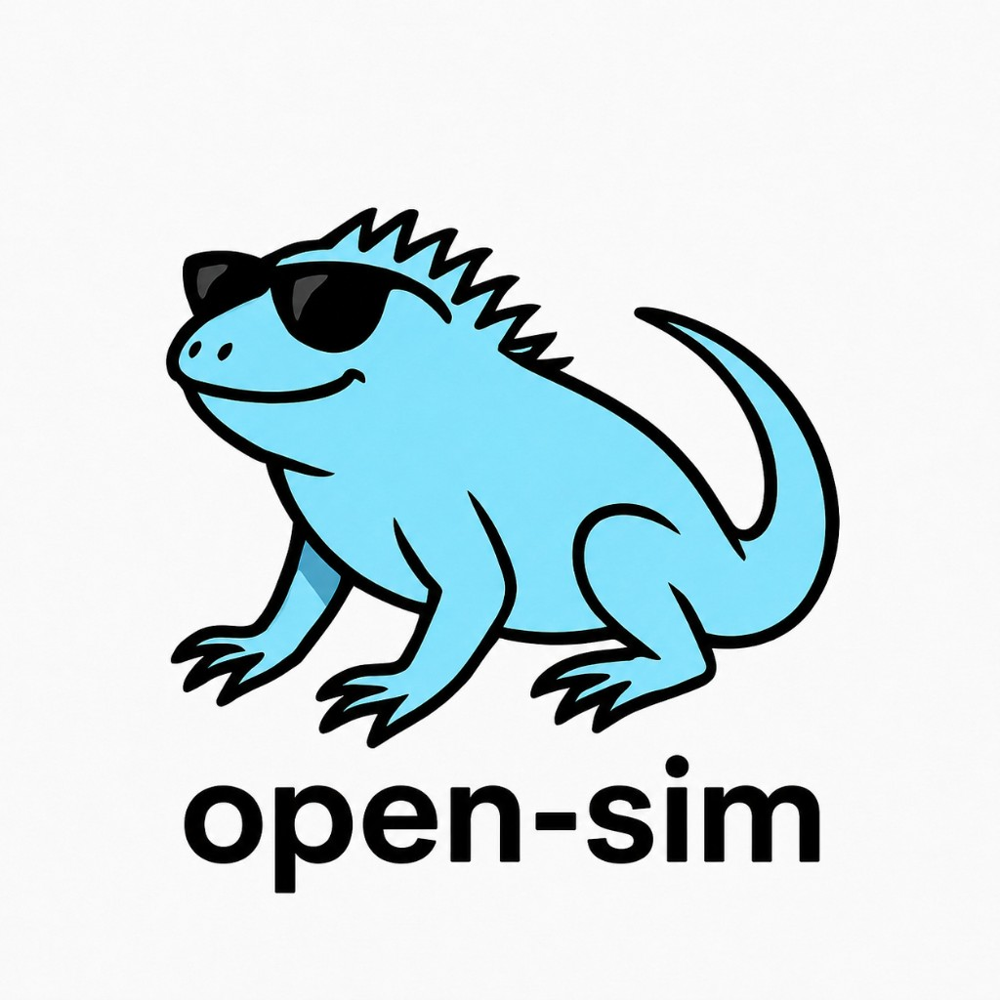

<p align="center">
  
</p>

<p align="center"><em>Meet Scratchy — the iguana who drives your simulator. He really likes when people ⭐ the project.</em></p>

# open-sim

A custom **Model Context Protocol (MCP)** server that lets Claude drive the **iOS Simulator** end-to-end — device control via `simctl`, and **in-app UI** via a generic XCUITest driver.

No hardcoded apps or labels. Claude looks at what's on screen, decides what to do, and acts.

## Requirements

- macOS with **Xcode** installed (`xcrun simctl` + XCUITest)
- **Node.js 18+**

## Install & build

```bash
npm install
npm run build:all    # builds XCUITest driver + Node server
```

Or separately:

```bash
npm run build:driver   # compile SimDriverUITests (first time / after Swift changes)
npm run build          # compile MCP server
```

## Connect to Cursor

`.cursor/mcp.json` is already configured:

```json
{
  "mcpServers": {
    "open-sim": {
      "command": "node",
      "args": ["${workspaceFolder}/dist/index.js"]
    }
  }
}
```

Open this folder in Cursor → **Settings → MCP** → enable `open-sim`.

## How it works (fluid, no hardcoding)

```
You: "Open Settings and turn on Airplane Mode"
         ↓
Claude: boot_device → launch_app / open_url / ui_tap
         describe_ui  → reads accessibility tree (labels, frames, types)
         screenshot   → sees the screen
         ui_tap       → taps by labelContains:"Airplane" or coordinates
         screenshot   → verifies
```

**Nothing is baked in per app.** The server exposes generic primitives. Claude reasons about whatever is on screen.

### Targeting options (all fluid)

| Method | Example | When to use |
|--------|---------|-------------|
| `labelContains` | `"Settings"`, `"Sign In"` | Most common — uses visible text |
| `identifier` | `"Safari"`, `"email_field"` | When accessibility identifiers exist |
| `type` | `button`, `switch`, `textField` | Filter by element kind |
| `x` / `y` (0–1) | `x: 0.5, y: 0.9` | Coordinates from screenshot + screen size |
| `ui_swipe` | `direction: "left"` | Navigate home screen pages, scroll lists |

After `launch_app`, the bundle ID is remembered — you don't need to repeat it for UI tools.

## App knowledge & skills (faster repeat automation)

open-sim can drive any app with zero hardcoding, but **exploring an app from scratch every time is slow** — each `describe_ui` call takes several seconds, and the agent may need many of them to find the right button or flow.

This repo adds a **local knowledge layer** and **Cursor skills** so the agent learns an app once and reuses that context on every future task.

### How it fits together

```
First time with an app          Every task after that
        ↓                                ↓
   learn-app skill              read knowledge/apps/<app>.md
   explore via open-sim          follow documented flows
   save to knowledge/            fewer describe_ui calls
        ↓                                ↓
   update-knowledge-from-chat    patch doc after each session
   (merge new learnings)          agent keeps getting smarter
```

| Piece | Location | In git? |
|-------|----------|---------|
| App maps (flows, labels, gotchas) | `knowledge/apps/<slug>.md` | No — gitignored, local to your machine |
| Test case template (conventions, structure) | `test_cases/template.md` | Yes — shared with the repo |
| Executable test cases (Given/When/Then) | `test_cases/apps/<slug>.md` | No — gitignored, local to your machine |
| **learn-app** skill | `.cursor/skills/learn-app/` | Yes — shared with the repo |
| **update-knowledge-from-chat** skill | `.cursor/skills/update-knowledge-from-chat/` | Yes — shared with the repo |
| **add-test-case-from-chat** skill | `.cursor/skills/add-test-case-from-chat/` | Yes — shared with the repo |

Knowledge files capture navigation maps, element references, and informal flows. **Test case** files in `test_cases/apps/` distill the same flows into numbered, runnable scenarios (`TC-SCRIB-001`, etc.) with explicit Given/When/Then steps and verification criteria — useful for regression checks and agent self-verification after automation.

### Why it speeds things up

| Without knowledge | With knowledge |
|-------------------|----------------|
| `describe_ui` on every screen to find tabs and buttons | Jump straight to documented `label` / `identifier` |
| Agent reasons through UI from scratch each session | Follow a known flow (e.g. "create timed reminder") |
| Same mistakes repeated (duplicate taps after timeouts) | Gotchas captured once — verify before retrying |
| ~4–7s per `describe_ui` × many screens | Often 2–4 targeted steps with one verify at the end |

Example: *"Go to Scrib and make a reminder to say hi to mom"* — with `knowledge/apps/scrib.md`, the agent launches Scrib, taps Reminders → Add, types the text, taps Create Reminder. Without it, the agent must discover the tab bar, the Add button, the text field type, and the confirm button via multiple round-trips.

### Skills

#### learn-app

**When:** First time mapping an app, or a full refresh.

**Prompt examples:**
- "Learn the Scrib app"
- "Map out Settings and save it to knowledge"

The agent uses open-sim to explore tabs, screens, and key flows, then writes `knowledge/apps/<slug>.md` (e.g. `scrib` for Scrib).

#### update-knowledge-from-chat

**When:** After a session where the agent did something new — discovered a flow, hit a new screen, or learned a gotcha.

**Prompt examples:**
- "Update Scrib knowledge from what we just did"
- `/update-knowledge-from-chat` for the Scrib app

The agent **merges** deltas into the existing file (new flows, elements, corrections) — it does not replace the whole doc.

### Using knowledge day to day

1. **Teach an app once** — ask the agent to learn an app you automate often.
2. **Give task prompts normally** — e.g. "In Scrib, delete the reminder and add a note that says hello."
3. **Agent reads knowledge first** — if `knowledge/apps/scrib.md` exists, it plans from that file.
4. **Update after novel work** — ask to update knowledge when the agent figured out something new (edit mode, delete flow, etc.).

Knowledge maps are **local only** (`knowledge/` is gitignored). Per-app test suites in `test_cases/apps/` are local too; the shared **template** at `test_cases/template.md` is committed so everyone uses the same conventions (IDs, timeout, Given/When/Then format). Skills in `.cursor/skills/` are committed as well.

### Test cases

```
test_cases/
  template.md          # in git — copy when adding a new app
  apps/                # gitignored — local suites per app
    scrib.md
    safari.md
```

When learning or updating an app, add or extend test cases for flows worth re-running (smoke + regression). The agent can read `test_cases/apps/<slug>.md` before a task to know what “done” looks like, or after automation to verify against the **Then** clauses.

Each test case has a **3-minute global timeout**: clock starts on the first **When** step; if **Then** is not verified in time, the case fails and the run moves on.

Use **add-test-case-from-chat** to capture flows from a session into `test_cases/apps/<slug>.md` (asks which cases to add when several are candidates).

### Example prompts (with knowledge)

- "Learn the Scrib app and save it to knowledge."
- "Go to Scrib and set a reminder to call mom in 5 minutes."
- "Update Scrib knowledge from what we just did."
- "In Scrib, delete the current reminder and add a scrib that says third times the try."

## Performance (persistent driver)

The XCUITest runner is the slow part of UI automation — a normal `xcodebuild test`
cold-start takes ~15-25s. To avoid paying that on *every* command, the server keeps a
**persistent daemon**: the test runner is launched once and then loops, reading
sequence-numbered commands from `/tmp/open-sim/active/command.json` and writing
results to `result.json`.

| Action | Cold start each command (old) | Persistent daemon (now) |
|--------|------------------------------|--------------------------|
| First command | ~20-25s | ~13s (one-time) |
| Tap | ~20-25s | ~2-3s |
| describe_ui | ~25-30s | ~0.5s |
| 6-command flow | ~120-150s | ~10s |

### Fast `describe_ui` (single snapshot)

Reading a property off a *live* `XCUIElement` (`label`, `frame`, `isHittable`, …) is a separate
cross-process call each time. Walking a screen property-by-property meant hundreds of round-trips
(~4-7s). Instead `describe_ui` takes **one `app.snapshot()`** — the whole accessibility tree in a
single call — and reads everything from memory. The only property a snapshot can't provide is
`isHittable` (it needs live hit-testing), so that's refined with a small, capped set of live checks
on just the interactive elements worth tapping. Net result: accurate output in ~0.5s instead of
several seconds, so multi-step app flows feel interactive. If `snapshot()` is ever unavailable the
driver falls back to the older live walk automatically.

The daemon stays alive for 15 min of idle time, then exits; the next command respawns
it automatically. It's also respawned if the simulator restarts or the device changes.
Timeouts are tuned to fail fast: ~30s for daemon startup, ~10s per UI command, ~1s for
app foreground waits — so a bad command surfaces in seconds, not minutes.
A `daemon.flag` file in the active dir signals daemon mode to the in-simulator runner
(env vars don't propagate into the test process). Delete it to force single-shot mode
for debugging. Batch related actions with `ui_act` to share a single round-trip.

## Example prompts

**Simulator (generic):**
- "Boot iPhone 17 Pro, show me what's on the home screen."
- "Tap the Settings app, describe what's on screen, then toggle the first switch you find."
- "Launch com.example.MyApp, type hello@example.com into the email field, and screenshot."
- "Swipe left on the home screen, tap Safari, and describe the page."
- "Set dark mode, override status bar to 9:41 with full battery, screenshot."

**App knowledge:**
- "Learn the Scrib app."
- "Go to Scrib and make a reminder to say hi to mom."
- "Update Scrib knowledge from this chat."

## Tools

### Device & OS (`simctl`)

| Tool | Description |
|------|-------------|
| `list_devices` | List simulators + state + UDIDs |
| `boot_device` / `shutdown_device` | Boot or shut down |
| `open_simulator` | Open the Simulator GUI |
| `install_app` / `launch_app` / `terminate_app` | App lifecycle |
| `screenshot` | Capture screen (returns image) |
| `set_location` / `set_privacy` / `set_appearance` | Environment |
| `set_status_bar` / `push_notification` | Status bar & push |
| `run_simctl` | Raw `simctl` escape hatch |

### In-app UI (XCUITest — any app)

| Tool | Description |
|------|-------------|
| `describe_ui` | Accessibility tree: labels, types, frames, hittable state |
| `ui_tap` | Tap by query (`labelContains`, `identifier`, `type`) or normalized coordinates |
| `ui_swipe` | Swipe direction or drag between coordinate pairs |
| `ui_type` | Type text; optionally focus a field first via query or coordinates |
| `ui_long_press` | Long press element or coordinate |
| `ui_wait` | Pause for animations/loading |
| `ui_act` | Run up to 20 actions in one XCUITest session (faster) |

## Architecture

```
Claude (Cursor MCP)
    ↓ stdio
open-sim (Node) ── simctl ──→ device/OS control
    ↓ spawns once: xcodebuild test-without-building (daemon)
SimDriverUITests (Swift) ── poll loop ──→ tap / swipe / type / describe on any app
```

The XCUITest driver lives in `driver/SimDriverHost/`. The runner starts once and polls
`/tmp/open-sim/active/command.json` for sequence-numbered commands, writing results to
`result.json` — keeping the session warm across calls. No app-specific logic.

## Development

```bash
npm run watch          # recompile TypeScript on change
npm run build:driver   # rebuild after Swift changes
npm run typecheck
```

---

<p align="center">
  If open-sim is useful to you, a ⭐ on GitHub helps others find it — and keeps Scratchy happy.
</p>

## License

MIT
